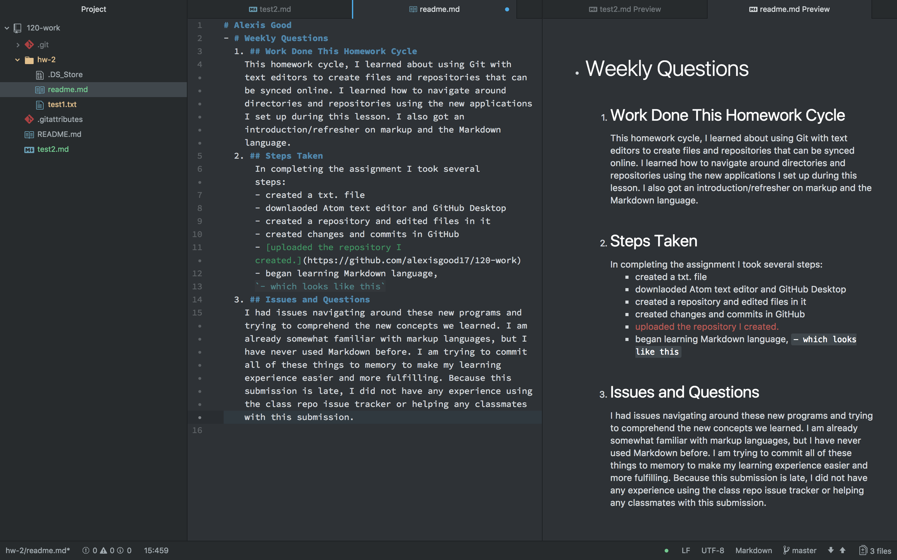

# Alexis Good
* # Weekly Questions
  ## 1. Work Done This Homework Cycle
    This homework cycle, I learned about using Git with text editors to create files and repositories that can be synced online. I learned how to navigate around directories and repositories using the new applications I set up during this lesson. I also got an introduction/refresher on markup and the Markdown language.
  ## 2. Steps Taken
    In completing the assignment I took several steps:
    - created a txt. file
    - downlaoded Atom text editor and GitHub Desktop
    - created a repository and edited files in it
    - created changes and commits in GitHub
    - [uploaded the repository I created.](https://github.com/alexisgood17/120-work)
    - began learning Markdown language,
    `- which looks like this`
 ## 3. Issues and Questions
  I had issues navigating around these new programs and trying to comprehend the new concepts we learned. I am already somewhat familiar with markup languages, but I have never used Markdown before. Most issues I encountered this lesson involved tweaking my formatting in Markdown to make this submission look correct. I am trying to commit all of these things to memory to make my learning experience easier and more fulfilling. Because this submission is late, I did not have any experience using the class repo issue tracker or helping any classmates with this submission.

